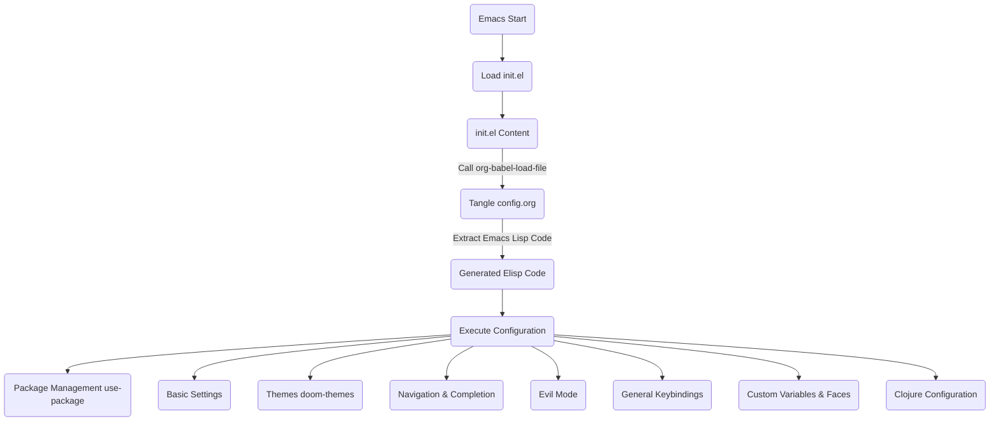

```mermaid
graph TD
    A(Emacs Start) --> B(Load init.el)
    B --> C(init.el Content)
    C -- "Call org-babel-load-file" --> D(Tangle config.org)
    D -- "Extract Emacs Lisp Code" --> E(Generated Elisp Code)
    E --> F(Execute Configuration)
    F --> G(Package Management use-package)
    F --> H(Basic Settings)
    F --> I(Themes doom-themes)
    F --> J(Navigation & Completion)
    F --> K(Evil Mode)
    F --> L(General Keybindings)
    F --> M(Custom Variables & Faces)
    F --> N(Clojure Configuration)
```