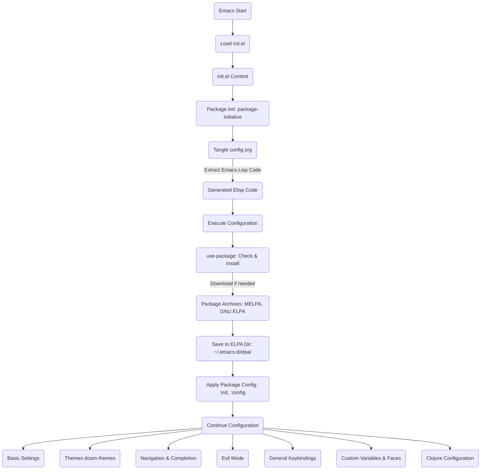

```mermaid
graph TD
    A(Emacs Start) --> B(Load init.el)
    B --> C(init.el Content)
    C --> P1(Package Init: package-initialize)
    P1 --> D(Tangle config.org)
    D -- "Extract Emacs Lisp Code" --> E(Generated Elisp Code)
    E --> F(Execute Configuration)

    F --> G(use-package: Check & Install)
    G -- "Download if needed" --> G_ARCHIVES(Package Archives: MELPA, GNU ELPA)
    G_ARCHIVES --> G_ELPA_DIR(Save to ELPA Dir: ~/.emacs.d/elpa/)
    G_ELPA_DIR --> G_CONFIG(Apply Package Config: :init, :config)
    G_CONFIG --> F_CONTINUE(Continue Configuration)

    F_CONTINUE --> H(Basic Settings)
    F_CONTINUE --> I(Themes doom-themes)
    F_CONTINUE --> J(Navigation & Completion)
    F_CONTINUE --> K(Evil Mode)
    F_CONTINUE --> L(General Keybindings)
    F_CONTINUE --> M(Custom Variables & Faces)
    F_CONTINUE --> N(Clojure Configuration)
```